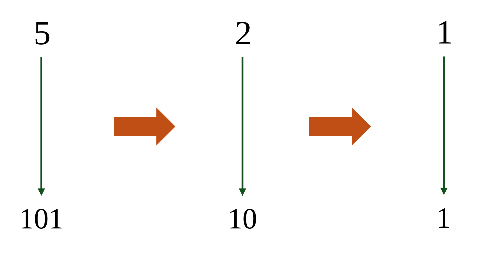

# OneCodeChallenge

Try to code problems in CodeForce, Luogu, Nowcoder and LeetCoder for $\times 82$ days.

- Easy Problems: [Day1-10](./Day1-10/), [Day11-20](./Day11-20/), [Day21-30](./Day21-30/), [Day31-40](./Day31-40/), [Day41-50](./Day41-50/), [Day51-60](./Day51-60/), [Day61-70](./Day61-70/), [Day71-80](./Day71-80/).

Here are some problems which I attached solving pictures:

|Problems|How to solve?|
|---|---|
|[P4326 Luogu](https://www.luogu.com.cn/problem/P4326)||
|[P4956 Luogu](https://www.luogu.com.cn/problem/P4956)||
|[P1876 Luogu](https://www.luogu.com.cn/problem/P1876)||
|[P2907 Luogu](https://www.luogu.com.cn/problem/P2907)||
|[P5713 Luogu](https://www.luogu.com.cn/problem/P5713)||
|[P5720 Luogu](https://www.luogu.com.cn/problem/P5720)||
