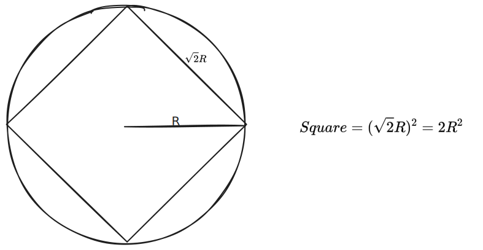
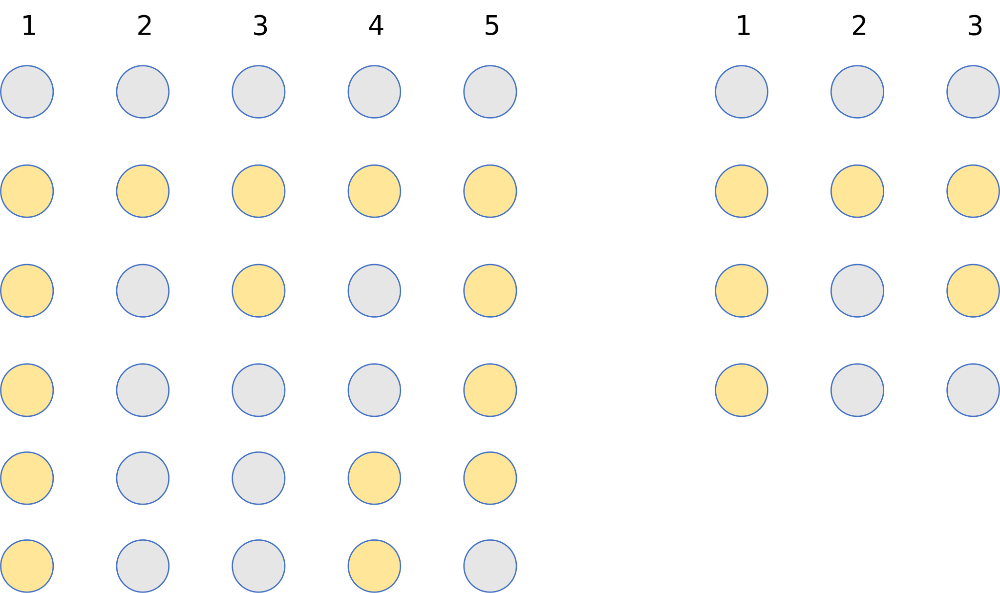
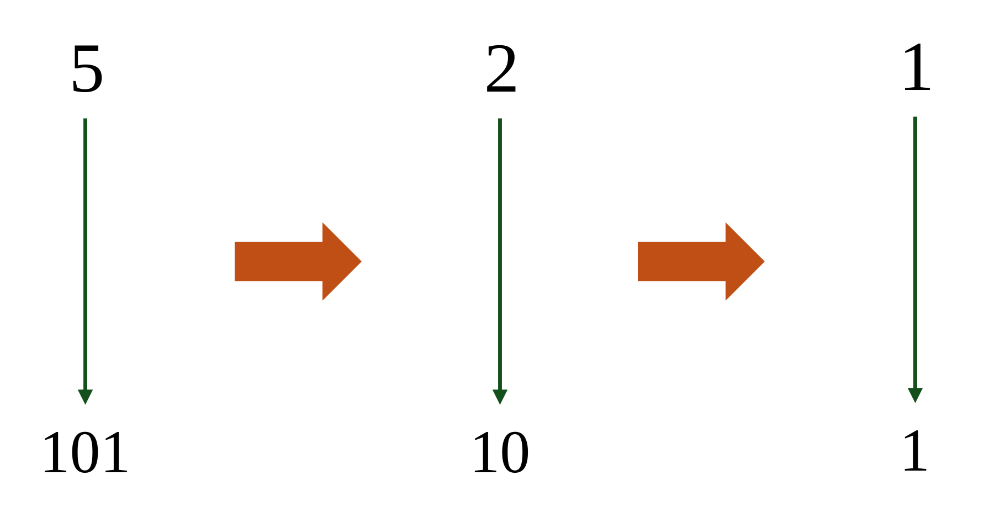

# OneCodeChallenge

Hi, I'm Junital. This repository is designed for challenging myself, in which I will try to code problems in CodeForce, Luogu, Nowcoder and LeetCoder everyday. Now I have coded for $\times 223$ days.

- Easy Problems: [Day1-100](./Day1-100/), [Day101-200](./Day101-200/), [Day201-210](./Day201-210/).
- Medium Problems：[P2064](./Day1-100/Day81-90/Day88/P1319inLuogu.cpp)
- Sticky Problems: [CodeForce 1742D](./Day1-100/Day71-80/Day75/1742DinCodeForce.cpp).

Here are some problems which I attached solving pictures:

|Problems|How to solve?|
|---|---|
|[B2619 Luogu](https://www.luogu.com.cn/problem/B2619)||
|[B2607 Luogu](https://www.luogu.com.cn/problem/B2607)||
|[P8012 Luogu](https://www.luogu.com.cn/problem/P8012)||
|[P9585 Luogu](https://www.luogu.com.cn/problem/P9585)||
|[P7965 Luogu](https://www.luogu.com.cn/problem/P7965)||
|[P6337 Luogu](https://www.luogu.com.cn/problem/P6337)||
|[P1980 Luogu](https://www.luogu.com.cn/problem/P1980)||
|[P2911 Luogu](https://www.luogu.com.cn/problem/P2911)||
|[P4956 Luogu](https://www.luogu.com.cn/problem/P4956)||
|[P2064 Luogu](https://www.luogu.com.cn/problem/P2064)||
|[P4326 Luogu](https://www.luogu.com.cn/problem/P4326)||
|[P1876 Luogu](https://www.luogu.com.cn/problem/P1876)||
|[P6153 Luogu](https://www.luogu.com.cn/problem/P6153)||
|[P2907 Luogu](https://www.luogu.com.cn/problem/P2907)||
|[P5713 Luogu](https://www.luogu.com.cn/problem/P5713)||
|[P5720 Luogu](https://www.luogu.com.cn/problem/P5720)||
|[P4702 Luogu](https://www.luogu.com.cn/problem/P4702)||
|[P1614 Luogu](https://www.luogu.com.cn/problem/P1614)||
|[P2705 Luogu](https://www.luogu.com.cn/problem/P2705)||
|[P1424 Luogu](https://www.luogu.com.cn/problem/P1424)||
