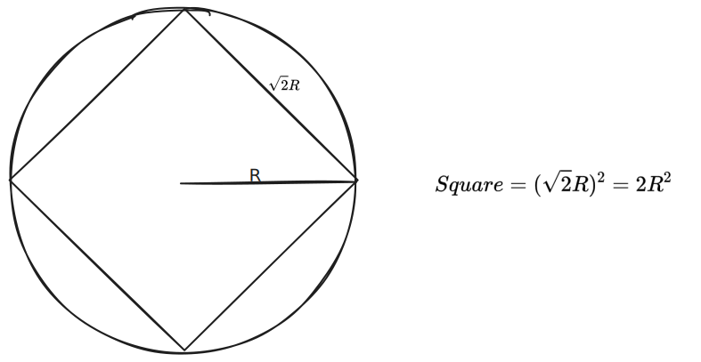

# OneCodeChangllenge

Try to code Luogu, Nowcoder and LeetCoder in one $\times 49$ days.

- Easy Problems: [Day1-10](./Day1-10/), [Day11-20](./Day11-20/), [Day21-30](./Day21-30/), [Day31-40](./Day31-40/).

Here are some problems which I attached solving pictures:

|Problems|How to solve?|
|---|---|
|[P4326 Luogu](./Day1-10/Day1/P4326inLuogu.cpp)||
|[P4956 Luogu](./Day22/P4956inLuogu.cpp)||
